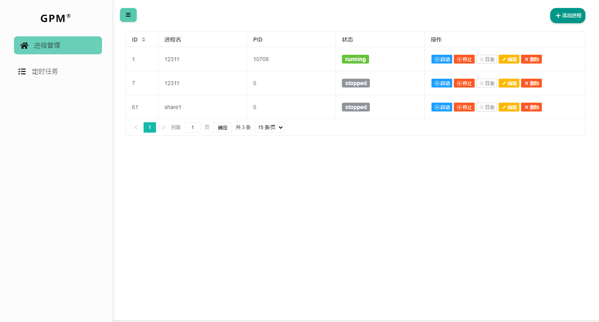
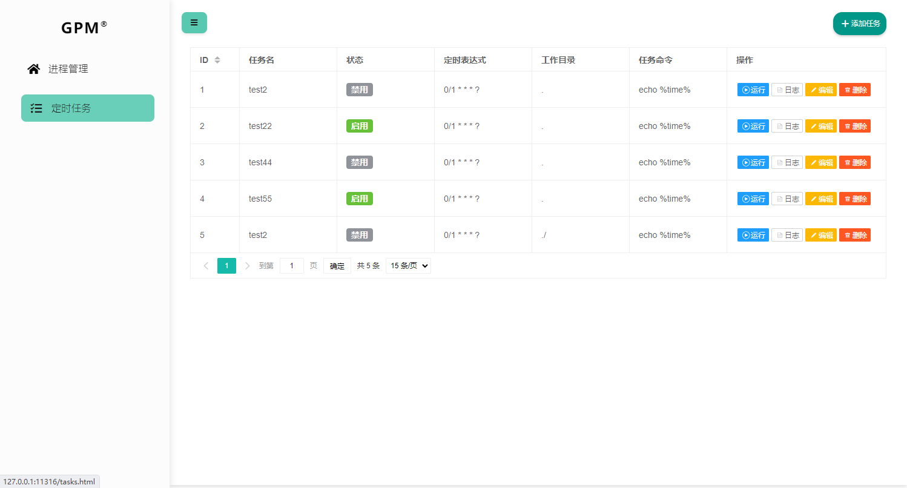
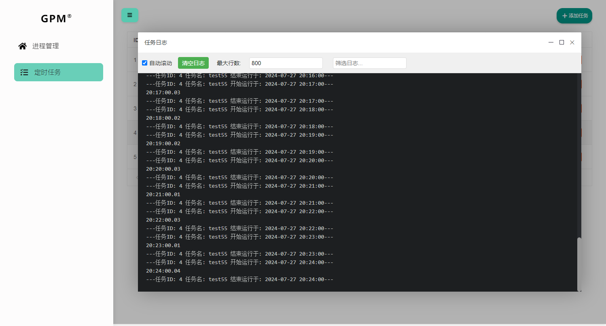

golang编写的带web管理界面的进程管理工具,类似supervisord,使用sqlite数据库存储,支持windows,linux平台

## 快速开始

下载可执行文件到本地,并双击运行或者命令行安装系统服务

```
goprocess.exe install
goprocess.exe start
goprocess.exe stop
goprocess.exe uninstall

./goprocess install
./goprocess start
./goprocess stop
./goprocess uninstall
```
访问web界面: http://127.0.0.1:11315


可开启权限控制，默认不开，密码可在配置文件中配置 

## 截图









